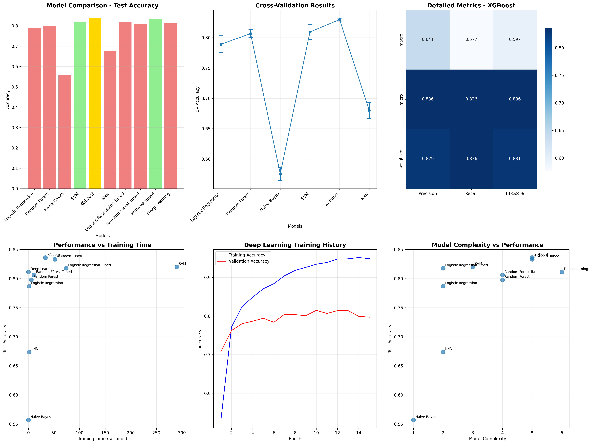
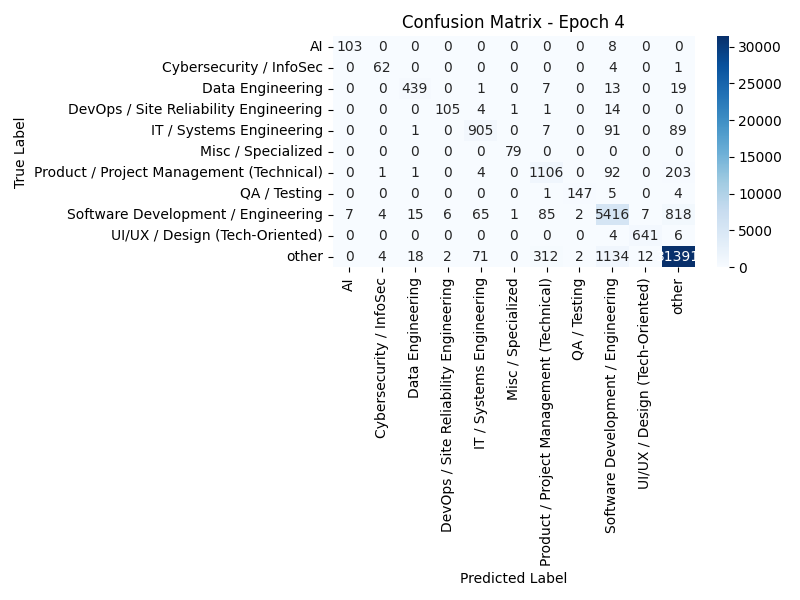
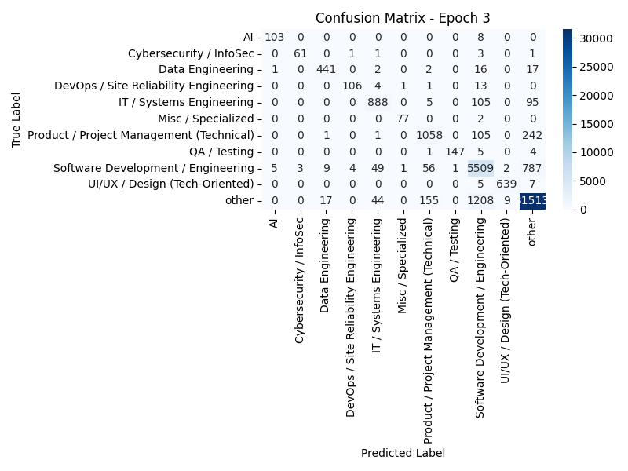

# Job Classifier Project

## Overview

This project contains three main components:
- `job_classifier.py` – Trains and runs a job classification model.
- `scraper.py` – Scrapes job-related data for training/testing.
- Displays all images from the `output/` folder.


### Sample Output






### Job Categories

- Software Development / Engineering
- DevOps / Site Reliability Engineering
- AI
- Data Engineering
- Cybersecurity / InfoSec
- IT / Systems Engineering
- QA / Testing
- Product / Project Management (Technical)
- UI/UX / Design (Tech-Oriented)
- Misc / Specialized
- other

## Requirements

- Python 3.12+

### Install Dependencies

Install all required packages using `requirements.txt`:

```bash
python3.12 -m pip install -r requirements.txt


